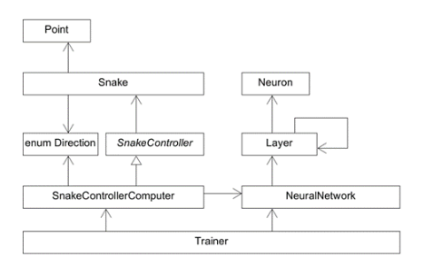

# Neuroevolution Snake

This project was created as the practical part of a paper on artificial neural networks and genetic training algorithms.

Every part of this test including all parts of the neural network model and training algorithms were built from the ground up using C++.

# Goal

The goal was to create a basic program utilizing a neural networks and genetic training algorithms to improve in playing snake. 

## Setup 

The basic class structure can be seen in the UML Class Diagram below.

## Research Paper (German)

The corresponding research paper can be made available on request. Take note that it is written in German.

## License

MIT. Feel free to reuse and modify. No gurantee.
